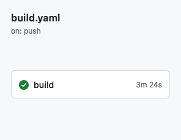
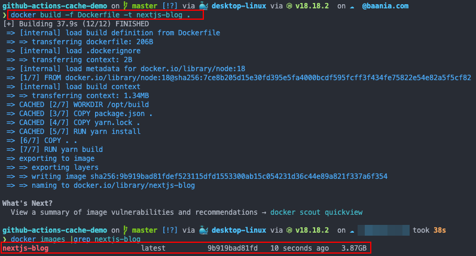

# Faster deployments with multi-stage build caching

Here's to incremental deployments.

---

<!-- copied from <https://raw.githubusercontent.com/MiryangJung/2022-feconf-slides-rescript-together/main/slides.md> -->

# About me

<div class="flex mt-10">
  <div class="flex flex-col mr-200px">
    
    <div class="flex items-center mt-10">
      <carbon-logo-github />
      <a class="ml-1" href="https://github.com/kahnwong" target="_blank">kahnwong</a>
    </div>
    <div class="flex items-center mt-3">
      <carbon-logo-linkedin />
      <a class="ml-1" href="https://www.linkedin.com/in/karnsiree-w-7b535b202/" target="_blank">Karnsiree Wong</a>
    </div>
    <div class="flex items-center mt-3">
      <carbon-link />
      <a class="ml-1" href="https://karnwong.me/" target="_blank">karnwong.me</a>
    </div>
  </div>
  <ul class="font-semibold">
    <li class="my-3">Head of Platform Engineering @Baania</li>
    <li class="my-3">Often known as DevSecMLFinDataOps</li>
    <li class="my-3">Faster deployments -> Faster iterations</li>
    <li class="my-3">I love automation</li>
  </ul>
</div>

---
layout: center
---
# CI/CD workflow


---


# Dockerfile

```dockerfile
FROM node:18

WORKDIR /opt/build

COPY package.json .
COPY yarn.lock .
RUN yarn install

COPY . .

RUN yarn build

EXPOSE 3000
CMD [ "yarn", "start", "-H", "0.0.0.0" ]
```

---

# GitHub Actions Buildx

```yaml
- name: Build and tag image
  uses: docker/build-push-action@v5
  with:
    context: .
    builder: ${{ steps.buildx.outputs.name }}
    file: Dockerfile
    push: true
    tags: ${{ steps.meta.outputs.tags }}
    provenance: false
```

---
layout: center
---

# But we can cache docker layers

---

# GitHub Actions Buildx with cache

```yaml
- name: Build and tag image
  uses: docker/build-push-action@v5
  with:
    context: .
    builder: ${{ steps.buildx.outputs.name }}
    file: Dockerfile
    push: true
    cache-from: type=gha # add this
    cache-to: type=gha,mode=max # add this
    tags: ${{ steps.meta.outputs.tags }}
    provenance: false
```

---
layout: two-cols
---

# Buildx



::right::

# Buildx with cache


---
layout: center
---
# How do we know that we're using cache?

---

# Check GitHub Actions caches from all workflows


---
layout: center
---

# What about image size?

---

# Dockerfile with multi-stage build

```dockerfile
# --------------- builder --------------- #
FROM node:18 AS builder

WORKDIR /opt/build

COPY package.json .
COPY yarn.lock .
RUN yarn install

COPY . .
RUN yarn build

# --------------- package --------------- #
FROM node:18-alpine AS deploy

WORKDIR /app
COPY --from=builder /opt/build/.next ./.next
COPY --from=builder /opt/build/node_modules ./node_modules
COPY --from=builder /opt/build/public ./public
COPY --from=builder /opt/build/next.config.js ./
COPY --from=builder /opt/build/package.json ./

EXPOSE 3000
CMD [ "yarn", "start", "-H", "0.0.0.0" ]
```

---

# Why multi-stage build?

- `yarn build` creates a lot of temporary files
- We don't need those "temporary files" for `yarn start`


---
layout: center
---

# Let's guess the image size!


---
layout: two-cols
---

# Normal build



::right::

# Multi-stage build


---

# How much can we save?

## Build time

- 30s per build (from 3m24s to 2m57s)

## Image storage (compressed)

- 300MB per image (from 450MB to 150MB)


---
layout: center
---

# Any questions?

---
layout: center
---

# Ready for cost reduction?

If we deploy 150 times / month

---

# Cost breakdown

| Service                  | No Cache           | With Cache           |
| ------------------------ | ------------------ | -------------------- |
| GitHub Actions (Runtime) | 3m24s * 150 = 510m | 2m57s * 150 = 442.5m |

<br>

| Service       | Normal Build       | Multi-Stage Build         |
| ------------- | ------------------ | ------------------------- |
| ECR (Storage) | 450MB * 150 = 66GB | 150MB * 150 = 22GB        |
| ECR (Cost)    | 150MB * 150 = 22GB | 22GB * 0.10 USD = 2.2 USD |

<br>

In total, we can save **67.5 minutes** and **4.4 USD** per month.

---

# I know you love pretty charts

<br>


---

# GitHub Actions Cache can also be used with runtimes


```yaml
steps:
- uses: actions/checkout@v4
- uses: actions/setup-node@v4
  with:
    node-version: 18
    cache: 'yarn'
- run: yarn install
- run: yarn build
```

---

# Let's revisit CI/CD workflow again


---
layout: center
---

# Any questions?

---

# Summary

- GitHub Actions cache can be used with docker image build and setup actions
- Multi-stage build can drastically reduce image size (in turn, reducing image storage cost)
- These lead to faster CI/CD run time and faster deployments
- During PR review, automated checks can be done faster as well

---

# Check out the slides and repo!


